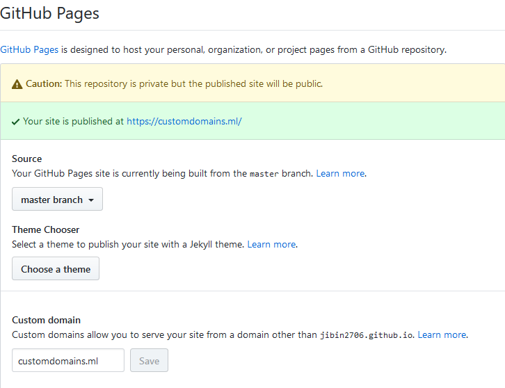

Github allows you to deploy your static sites free of charge. There are other services that also provide free hosting of static sites like Netlify, Firebase hosting, etc. Static sites will save you some money with free hosting that is provided by various companies.
Even my blog and portfolio sites are hosting using gh-pages.

**This post will provide you instructions for hosting sites in gh-pages with custom domains.**

### Configuring CNAME on Github Repository

Go to your repository, which you want to host.


In the settings panel, enable the source to the branch which you want to host. It can be your master branch or gh-pages branch.
You can put the files that need to be hosted in that branch and it should contain an index.html file.
It will now provide a link with a github.io domain.



But what about the custom domain?
Yes, for that you need to create a new file **CNAME** in the repository containing your domain name.


### Setting up DNS records

You need to add A records of Github pages servers on your DNS provider. (This can be done from where you bought your domain name).

```
185.199.108.153
185.199.109.153
185.199.110.153
185.199.111.153
```

It should look something like this (varies according to DNS providers).


Hurray! Your site will be online within a few minutes.
